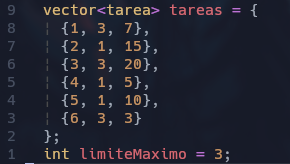
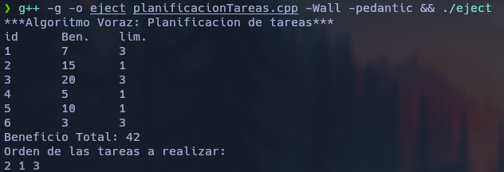

# Planificacion de Tareas
-   Ordenar el vector de mayor a menor en base al beneficio
-   Crear un vector de tamaño del limite maximo y setearlo con -1
-   Ir agregando los id del vector tareas segun su limite de forma decreciente

## Ejemplo

